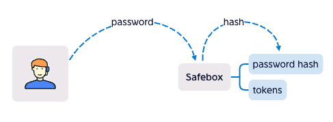
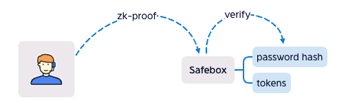

# zkpayroll

USDT and BUSD as salary is being popular, zkpayroll is a tool for salary manage and distribute, with zk-proof, it's privacy and security. The contracts have no owner, that means zkpayroll is running as a protocol, a infrastructure of DAO. 
The contracts have 3 features:

## 1.Batch Pay
 
If there're 100 salaries to pay, it needs 100 Txs, use batchPay, it only need 1 Tx. 
This is the basic feature, it can also use to hide the high salary. 
##### e.g. someone's salary is 10000 USDT (so high~), the admin ask him for 5 wallets to receive payment, every transation is no more than 2000 USDT in bathPay, is someone's salary more than 2000 USDT? No one knows. 
 
 

## 2.Stream Pay
You pay a payment to someone, the token is locked in the contract, it releases by the time, which means the recipient can claim every second, like stream. 
 
This is how the contract works: 
The sender deposits to the contract, the recipient claims from the contract, then the contract calculats how much the recipient can claim. 
The stream can be canceled by sender and recipient, then the contract auto claim for the recipient, and the remaining amount is back to the sender. 
The StreamPay.sol contract implements ERC1620 <https://eips.ethereum.org/EIPS/eip-1620> 
We extend getUserStreams() function，for frontend use. 
 
 

## 3.Zero knowledge Pay
Last year, we got 3 new teammates, they were newbies in Web3, we taught them to use wallet, told them the traps, but after the salary payment, 2 of 3 had bean stolen, because they donwloaded the fake Metamask. 
We recognize that the newbie's first salary is much easier to be stole. 
So We build safebox for everyone, give assets double safety. 
 
User create a safebox with password hash in the contract, the only way to withdraw from safebox is sending the correct password. So if the private key is taken by the hacker, without password, the hacker can't withdraw tokens from safebox. 
But the problem is that if the password was sent, everyone knows the password. 
So we use zk-proof instead. 
 
It can hide password, it works like signature, user signs the data with password, and the contract verify the signature. 
Following is how the "sign" works in zk circuit (in zk, the algorithm is called circuit). 
 
Poseidon is a kind of hash algorithm, it's circuit friendly and popular in zk circuits, the SHA256 we tried, but it didn't work well, so we chose Poseidon circuit instead. 
User input password, tokenAddr and amount, that means user knows the password, and he want to take the amount of token. The zk circuit output the proof and the result data, to proof that the password hash is generated by the hash algorithm, if the result modify, the verify in the contract will fail. 
The better than signature algorithm, we can design the output in zk. The result contains not only password hash, but also tokenAddr, amount, all hash. After verify success in contract, it will take amount of token from the correct safebox. 
We did something more in the contract: 
- One wallet One safebox. So we can send token to someone's safebox by his wallet address.
- User need create safebox once (register). After register, user knows the safebox. Maybe without register is better? We're discussing. 
- Only the safebox owner can withdraw. Double safety, if the wallet private key is taken, the safebox is safe. If the safebox password is taken, it's also safe. But if both private key and password are taken, that's so bad.

## FAQ
### If the project fail or be hacked, is my safebox safe?
Yes, the safebox is in the contract, and the contract has no owner, it's running forever and no one can modify it. 

### How long did zkpayroll developed?
Since 2022-5-4, for the Dora Hackthon <https://dorahacks.io/buidl/2790>. 

### How many Tx can batch into one?
293 in testing. 

### what is the product design base on?
Stay simple, stay protocol. 
A assets tool as Metamask. 

### what is the future plan?
Saving to earn? I guess. 